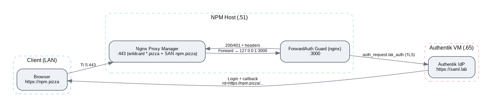

cat README.md 
# Homelab SSO — Authentik + Nginx Proxy Manager + Internal CA

[]()
[]()
[]()
[]()
[]()

> LAN-only Single Sign-On for homelab services using **Authentik** (IdP), **Nginx Proxy Manager** (entry), **ForwardAuth** (guard), **Pi-hole** (DNS), and an **internal CA** for TLS that actually matches the internal topology.



---

## 🚀 Elevator Pitch

This project turns a typical homelab into a **cohesive, secure SSO platform**:
- **Authentik** at `https://saml.lab` (192.168.2.65) is the central IdP.
- **NPM** at `https://npm.pizza` (192.168.2.51) is the managed entry point.
- A tiny **ForwardAuth** guard enforces authentication on NPM’s admin surface.
- An **internal CA** issues certs for `*.pizza` **and** `npm.pizza` (SAN).
- **Pi-hole** provides internal DNS for `.pizza` and `.lab`.

All of it works **entirely on LAN**, ready for portfolio screenshots & demos.

---

## 🎯 Why I built this (the “why” behind the work)

I wanted to show that I can design and implement **secure identity flows** end-to-end in a real environment:
- **SSO practicality**: replace “click-a-link on each box” with a central IdP.
- **TLS the right way**: internal CA + SANs that fit the *actual* hostnames.
- **Reverse proxy hardening**: put admin planes behind authentication.
- **DNS correctness**: trusted names for both human use and scripts.
- **Repeatability**: documented, scriptable, and minimal moving parts.

This is what I do professionally—**design defensible, reproducible infrastructure**—and I wanted that reflected in my homelab portfolio.

---

## 📚 What I learned (and solved)

- **SANs matter**: A wildcard `*.pizza` isn’t enough—**add `npm.pizza`** to SANs or cURL/browsers will complain.  
- **Trust chains**: Build a chain that clients can trust (Root → Leaf); install the root CA on workstations/servers.  
- **Pi-hole + systemd-resolved**: Know who’s listening on **:53** and avoid collisions with containers.  
- **ForwardAuth with Authentik**: Use `auth_request` to gate NPM Admin and pass identity headers upstream.  
- **Outpost endpoints**: Authentik’s nginx outpost provides **`/auth/nginx`** and **`/start?rd=…`**—super handy.  
- **Debugging TLS live**: I built a tiny Go tool (`tools/certpeek`) to read the live chain, SANs, and issuer from any host.  
- **Docker/Nginx gotchas**: Don’t bind to a port another container already owns (e.g., 8081 with Nextcloud).  
- **“Too many SSH keys”**: When automating, use `IdentitiesOnly yes` to avoid auth failures on first connect.

---

## 🧩 Components

| Layer | What | Why |
|------|------|-----|
| **IdP** | Authentik (`saml.lab`) | Central identity, SSO/OIDC/SAML |
| **Entry** | Nginx Proxy Manager (`npm.pizza`) | Simple TLS + routing with UI |
| **Guard** | nginx ForwardAuth | Enforces Auth prior to admin access |
| **DNS** | Pi-hole | `.pizza` + `.lab` resolution on LAN |
| **PKI** | Internal CA | Trust and SANs that match internal hosts |

---

## 🛠️ Quick start (for reviewers)

> This repo contains **examples** (no secrets). Replace placeholders and adapt to your environment.

1) **NPM compose** (with `/ssl` mount):  
`npm/docker-compose.yml.example`

2) **ForwardAuth guard** on `:3000`:  
`npm/guard/docker-compose.yml.example` + `npm/guard/nginx.conf.example`

3) **Authentik stack**:  
`authentik/docker-compose.yml.example` (Postgres + Redis + Server + Worker)

4) **DNS overrides** (Pi-hole):  
npm.pizza -> 192.168.2.51
saml.lab -> 192.168.2.65

markdown
Copy code

5) **Cert requirement**:  
Leaf cert **must** include **SANs**:  
- `DNS:*.pizza`  
- `DNS:npm.pizza`

6) **Smoke tests**:
```bash
# From NPM host (guard should redirect to start):
curl -I http://127.0.0.1:3000/ -H 'Host: npm.pizza'

# From any client (with CA installed):
curl -I https://npm.pizza
# Expect: 302 Location: https://saml.lab/outpost.goauthentik.io/start?rd=...
🔐 TLS, SANs, and CA (internal)
Root CA lives on NPM host and signs a leaf for *.pizza + npm.pizza.

Clients install the Root CA:

Ubuntu: copy to /usr/local/share/ca-certificates/ + sudo update-ca-certificates.

Windows: import into Trusted Root Certification Authorities.

Live verification:

bash
Copy code
# Inspect live chain and SANs (tool included in repo)
cd tools/certpeek && go mod tidy && go build -o certpeek
./certpeek npm.pizza:443
🔒 ForwardAuth concept (Nginx + Authentik)
NPM forwards to 127.0.0.1:3000.

Guard protects / with auth_request /ak_auth.

Unauthed → 401 → error_page → redirect to Authentik /start?rd=....

After login, Authentik redirects back to original URL; guard allows.

See npm/guard/nginx.conf.example.

🧪 Troubleshooting
“self-signed in chain”
→ install the Root CA on your client.

“no alternative certificate subject name matches 'npm.pizza'”
→ reissue leaf cert with SANs *.pizza and npm.pizza; reattach in NPM.

Port already in use
→ sudo ss -tulpn | grep :3000 (or whichever port); stop/rebind conflicting service.

More in docs/troubleshooting.md.

🗺️ Roadmap
 Authentik group-based access to NPM Admin (Admins only)

 mTLS between Guard ↔ Authentik for defense in depth

 GitHub Action to auto-render Graphviz .dot → .png

 Add screenshots/ (login, post-auth, NPM UI)

 Extend SSO to Grafana, Nextcloud, Portainer, Heimdall

## 🙌 Credits

Built with ❤️ by **Tim Heverin**.

Thanks to the open-source community — especially the **Authentik**, **Nginx Proxy Manager**, and **Pi-hole** teams — for their incredible work and documentation that made this integration possible.  

Special thanks to the **PowerShell, Go, and DevOps** communities for sharing ideas, patterns, and best practices that inspired much of this project.  

This project reflects not just the tooling, but the mindset — **automate everything, document everything, and learn from everything**.

---

⭐ **If you found this project helpful or inspiring, give it a star on [GitHub](https://github.com/dj-3dub/homelab-sso)!**
